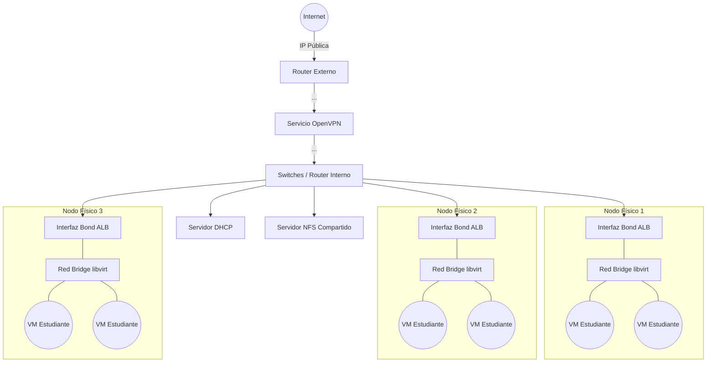
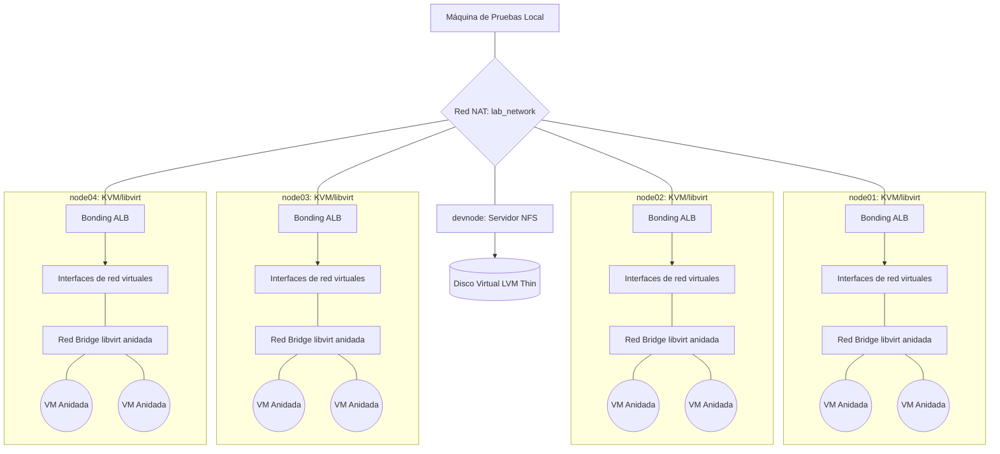

# Infraestructura del Sistema y Entorno de Pruebas

## Introducción

El objetivo de este documento es explicar la infraestructura física sobre la que se desplegará el sistema de aprovisionamiento de máquinas virtuales, así como detallar el proceso para replicar este entorno en un laboratorio de pruebas.

Dado que no es posible modificar la configuración de la red física, los switches o los routers en el entorno físico, el entorno de pruebas está diseñado para simular dichas condiciones de una manera aproximada mediante virtualización anidada.

## Términos y Conceptos

A continuación se expande en conceptos y tecnologías que serán necesarias en la implementación de la infraestructura:

**Virtualización base (KVM, QEMU y libvirt)**

La base de la virtualización emplea **KVM** (*Kernel-based Virtual Machine* o Máquina Virtual basada en el núcleo) y **QEMU** (*Quick Emulator*). KVM convierte el núcleo Linux en un hipervisor tipo 1, mientras que QEMU se encarga de emular los componentes de hardware (como discos o tarjetas de red). Para interactuar con estas tecnologías se utiliza **[libvirt](https://libvirt.org/)**, una **API** (*Application Programming Interface*) y conjunto de herramientas (`virsh`, `virt-install`) que simplifica la gestión. Siguiendo la [guía de virtualización en Fedora Server](https://docs.fedoraproject.org/en-US/fedora-server/virtualization/installation/#_installing_libvirt_virtualization_software), este software se instala sobre los servidores físicos (o simulados), los cuales se denominan **Anfitriones (*Hosts*) o en adelante, Nodos**. En la terminología propia de libvirt, a cada máquina virtual creada se le denomina **Dominio (*Guest*)**, mientras que a los repositorios o espacios lógicos donde se almacenan las imágenes y discos que consumen dichos dominios se les conoce como ***Pools* de almacenamiento** (*Storage Pools*).

**Redes, Bonding y ALB**

Para conectar los nodos de virtualización a la red se emplea **Bonding** (agrupación de enlaces). Utilizando *bonding* se consigue agrupar varias interfaces de red físicas en una única interfaz lógica virtual. En concreto, se configura el *bonding* en modo **ALB** (*Application Load Balancing* o Balanceo de Carga de Aplicaciones). Este modo balancea el tráfico de salida según la carga y gestiona el tráfico de entrada sin requerir que los switches de la red física posean configuraciones adicionales (como **LACP**, *Link Aggregation Control Protocol*). Su configuración se realiza mediante la herramienta `nmcli` basándose en la [documentación de Red Hat para redes](https://docs.redhat.com/en/documentation/red_hat_enterprise_linux/10/html/configuring_and_managing_networking/configuring-a-network-bond#configuring-a-network-bond-by-using-nmcli), con el objetivo de sumar el ancho de banda de las tarjetas y asegurar que, ante la desconexión de un cable, el nodo mantenga el acceso a la red.

**Gestión de discos (LVM y Aprovisionamiento fino)**

En la administración del almacenamiento se utiliza **LVM** (*Logical Volume Manager* o Gestor de Volúmenes Lógicos). Utilizando LVM, se desplegará un [volumen lógico *thin* o de aprovisionamiento fino](https://docs.redhat.com/en/documentation/red_hat_enterprise_linux/10/html/configuring_and_managing_logical_volumes/basic-logical-volume-management#overview-of-logical-volume-features) (*Thin Provisioning*) para reducir el espacio dedicado al almacenamiento de los volúmenes de los dominios.

**Almacenamiento unificado (NFS)**

Las imágenes de los discos de los dominios no residirán aisladas de forma local, sino en un almacenamiento compartido. Para ello, se despliega un [servidor **NFS**](https://docs.fedoraproject.org/en-US/fedora-server/services/filesharing-nfs-installation/) (*Network File System* o Sistema de Archivos en Red), un protocolo que permite a varios equipos acceder a un directorio a través de la red de forma simultánea. En esta arquitectura, el servidor NFS exporta un directorio que está respaldado a nivel de sistema por el volumen lógico *thin* de LVM mencionado anteriormente. Es en este directorio exportado por NFS es donde residen los volúmenes de disco de libvirt/qemu (como los archivos `.qcow2`), permitiendo a todos los nodos anfitriones operar con las mismas máquinas virtuales.

**Automatización de despliegues (Kickstart)**

Para simplificar la configuración del sistema operativo de cada nodo, se utiliza **[Kickstart](https://anaconda-installer.readthedocs.io/en/latest/user-guide/kickstart.html)**. Se trata de un método de instalación desatendida diseñado para sistemas operativos basados en Red Hat (como Fedora). Mediante un archivo de texto *Kickstart*, se definen previamente todas las respuestas que el instalador requiere (creación de usuarios, configuración del protocolo de acceso remoto **SSH** y particionado de discos).

## Entorno Físico

Esta sección describe cómo será el entorno real en producción que se espera una vez desplegado el sistema.

### Topología de red y funcionamiento del acceso

Se da por hecho que la red física cuenta con un servicio DHCP capaz de asignar automáticamente la configuración de red a cada interfaz conectada. Además, el rango de red es lo suficientemente amplio para proveer direcciones IP a todas las futuras máquinas virtuales que se generen.

En esa misma red física, o en una configurada con el enrutamiento adecuado hacia la red de los anfitriones, existe un servicio OpenVPN. Este servicio ya está configurado y es el método de acceso que permitirá a los estudiantes acceder directamente a sus máquinas virtuales desde el exterior.

### Nodos de virtualización

El sistema se configurará sobre varias máquinas físicas (anfitriones) preparadas de forma idéntica. Cada máquina tendrá múltiples interfaces de red conectadas a los switches físicos de la instalación.

Para maximizar el rendimiento y la disponibilidad, estas interfaces se agruparán a nivel de sistema operativo usando *bonding* en modo *Application Load Balancing* (ALB). Sobre esta interfaz agrupada, `libvirt` creará una red virtual de tipo *bridge*. Esto permite que las máquinas virtuales obtengan IPs directamente del servicio DHCP de la red física, garantizando que el enrutamiento desde la VPN de los estudiantes hasta la máquina virtual funcione sin aplicar reglas NAT adicionales.

### Almacenamiento compartido

Para guardar las imágenes de las máquinas virtuales se requiere un almacenamiento compartido unificado.

El entorno dispondrá de un servidor NFS accesible por todos los nodos de virtualización. En el entorno de pruebas, el sistema de ficheros de este servidor se construirá sobre un volumen lógico de aprovisionamiento fino (*thin logical volume* mediante LVM).

### Diagrama



## Diseño del entorno de pruebas

Dado los requisitos del entorno real, el laboratorio simulará la configuración física utilizando máquinas virtuales que, a su vez, ejecutarán máquinas virtuales (virtualización anidada).

### Topología virtual

En el sistema base donde se realicen las pruebas, se configurará una red virtual de tipo NAT denominada `lab_network`. Esta red simulará ser el switch físico y el servidor DHCP del entorno real.

Dentro de los nodos simulados, se recreará exactamente la arquitectura descrita en el apartado físico: se agruparán sus interfaces virtuales en un *bond*, y sobre él se creará la red *bridge* de `libvirt`. Ahí es donde se ejecutarán finalmente los dominios anidados de prueba.

### Distribución de nodos

Se definen de forma permanente 5 dominios base para la simulación. Todos inician una imagen de Fedora Server utilizando la instalación por red y configurando el acceso mediante SSH:

1.  **4 Nodos de virtualización (`node01` a `node04`):** Replican a las máquinas físicas. Tendrán instalados los paquetes de virtualización (KVM/libvirt) y contarán con 4 interfaces de red asociadas a `lab_network` para configurar el *bond*.
2.  **1 Nodo de almacenamiento (`devnode`):** En este dominio se configurará el servidor NFS que los nodos de cómputo usarán como almacenamiento compartido. A diferencia del resto, tiene un disco virtual adicional y de mayor tamaño para alojar el *pool* de almacenamiento.

### Diagrama de la arquitectura virtual



## Guía de despliegue

A continuación se detallan los pasos para crear y configurar el entorno virtual de pruebas.

### Creación de los nodos simulados

En el sistema base con `libvirt` se crea el *pool* de almacenamiento `vms` donde se guardarán los discos. Con la herramienta `virsh` se crean los volúmenes que van a usar los 5 dominios base:

```sh
virsh vol-create-as --pool vms --name node01.qcow2 --capacity 40G --format qcow2
virsh vol-create-as --pool vms --name node02.qcow2 --capacity 40G --format qcow2
virsh vol-create-as --pool vms --name node03.qcow2 --capacity 40G --format qcow2
virsh vol-create-as --pool vms --name node04.qcow2 --capacity 40G --format qcow2
virsh vol-create-as --pool vms --name devnode.qcow2 --capacity 40G --format qcow2
```

Se definen los dominios con `virt-install`. Inicialmente solo se configura una interfaz de red conectada a `lab_network` para realizar la instalación del SO base desde la ISO.

```sh
ISO_LOCATION="/.../isos/Fedora-Server-netinst-x86_64-43-1.6.iso"
IMAGES_LOCATION="/.../vms"

virt-install \
    --name node01 \
    --memory 4096 \
    --vcpus 4 \
    --location "$ISO_LOCATION" \
    --extra-args "console=ttyS0,115200n8 inst.text" \
    --disk "$IMAGES_LOCATION/node01.qcow2" \
    --network network=lab_network \
    --graphics none --console pty,target_type=serial \
    --autoconsole text
```

El comando se repite para el resto de volúmenes modificando el parámetro `--disk` y `--name`. Con `--autoconsole` se abre una conexión por puerto serie para acceder al instalador en modo texto inmediatamente tras definir el dominio.

### Instalación sistema operativo de los nodos

Una vez en la sesión Tmux del instalador Anaconda, se cambia al *shell* (`ctrl + b` y `2`) para crear un archivo *Kickstart* que automatice y simplifique la instalación. Este archivo se encarga de crear los usuarios, habilitar SSH y arrancar un servicio RDP para terminar el particionado de forma gráfica (ya que se desconoce la disposición exacta de discos en el entorno físico).

```sh
vi /tmp/anaconda-ks.config

anaconda --kickstart /tmp/anaconda-ks.config
```

Una vez finalizada la instalación y verificada la conexión, se conectan las 3 interfaces de red restantes en caliente a todos los nodos de cómputo (excepto en `devnode`):

```sh
virsh attach-interface --persistent --live --domain node01 --type network --source lab_network --model virtio
# Repetir para la tercera y cuarta interfaz, y para el resto de nodos (node02, node03, node04)
```

### Configuración de red

En cada dominio de cómputo, se configura el *bond* de las interfaces mediante `nmcli`. Primero, se eliminan los perfiles creados automáticamente por el sistema al detectar las nuevas tarjetas de red:

```sh
sudo nmcli connection delete "Wired connection 1" "Wired connection 2" "Wired connection 3" "Wired connection 4"
```

La ejecución de `nmcli device status` debería confirmar que hay 4 interfaces ethernet desconectadas. A continuación, se añade el perfil de tipo `bond` asociado a la interfaz lógica `bond0`, configurando el modo ALB y un periodo de monitorización cada 100 milisegundos:

```sh
sudo nmcli connection add type bond con-name bond0 ifname bond0 bond.options "mode=balance-alb,miimon=100"
```

Se crean los perfiles esclavos vinculados al *bond* maestro por cada interfaz de red física disponible:

```sh
sudo nmcli connection add type ethernet slave-type bond con-name bond0-slave-enp9s0 ifname enp9s0 master bond0
sudo nmcli connection add type ethernet slave-type bond con-name bond0-slave-enp10s0 ifname enp10s0 master bond0
sudo nmcli connection add type ethernet slave-type bond con-name bond0-slave-enp11s0 ifname enp11s0 master bond0
sudo nmcli connection add type ethernet slave-type bond con-name bond0-slave-enp12s0 ifname enp12s0 master bond0
```

Se levanta la conexión maestra, lo que activa a los esclavos de forma automática, y se comprueba el estado:

```sh
sudo nmcli con up bond0
sudo cat /proc/net/bonding/bond0
```

### Implementación del almacenamiento compartido NFS

En el sistema base de pruebas, se crea un disco adicional grande y se añade en caliente al dominio `devnode`:

```sh
virsh vol-create-as --pool vms --name devnode_nfs.qcow2 --capacity 100G --format qcow2

virsh attach-disk --persistent --live --domain devnode --source /.../vms/devnode_nfs.qcow2 --target vdb --targetbus virtio --driver qemu --subdriver qcow2
```

Dentro de `devnode`, se prepara este disco para usar un esquema LVM con aprovisionamiento fino (*thin pool*). Los pasos a seguir como usuario `root` son:

```sh
pvcreate /dev/vdb
vgcreate nfs_vg /dev/vdb
lvcreate --type thin-pool --size 95G --name nfs_pool nfs_vg
lvcreate --type thin --virtualsize 95G --name nfs_lv --thinpool nfs_pool nfs_vg
```

Se prepara el sistema de ficheros, los directorios y el usuario de servicio:

```sh
mkdir /srv/nfs
adduser -c 'nfs pseudo user' -b /nonexisting -M -r -s /sbin/nologin nfs
mkfs.xfs /dev/nfs_vg/nfs_lv
mkdir -p /srv/nfs/vlab_project
chown -R nfs:nfs /srv/nfs/*
```

Se abren los puertos del firewall necesarios para el servicio NFS:

```sh
firewall-cmd --permanent --add-service=nfs
firewall-cmd --reload
```

Se configura qué directorio se va a compartir añadiéndo la ruta a `/etc/exports` indicando la red `lab_network` desde donde se permite montar el directorio (obteniendo previamente el UID y GID del usuario `nfs` ejecutando `id nfs`, asumiendo que es 987 en este ejemplo):

```text
/srv/nfs/vlab_project  10.140.87.0/24(rw,async,no_subtree_check,all_squash,anonuid=987,anongid=987)
```

Por último, se exporta el directorio y se arranca el servicio:

```sh
exportfs -arv
systemctl enable nfs-server --now
```

### Instalación de los paquetes para usar virtualización anidada

En cada uno de los nodos de virtualización (`node01` a `node04`), se instalan los paquetes necesarios para que actúen como hipervisores completos:

```sh
sudo dnf install qemu-kvm-core libvirt virt-install guestfs-tools
```

Y se activa el servicio para que arranque automáticamente con el sistema:

```sh
sudo systemctl enable --now libvirtd.service
```

=====================

TODO

### Definición de los pools NFS

### Creación de las redes virtuales tipo bridge
